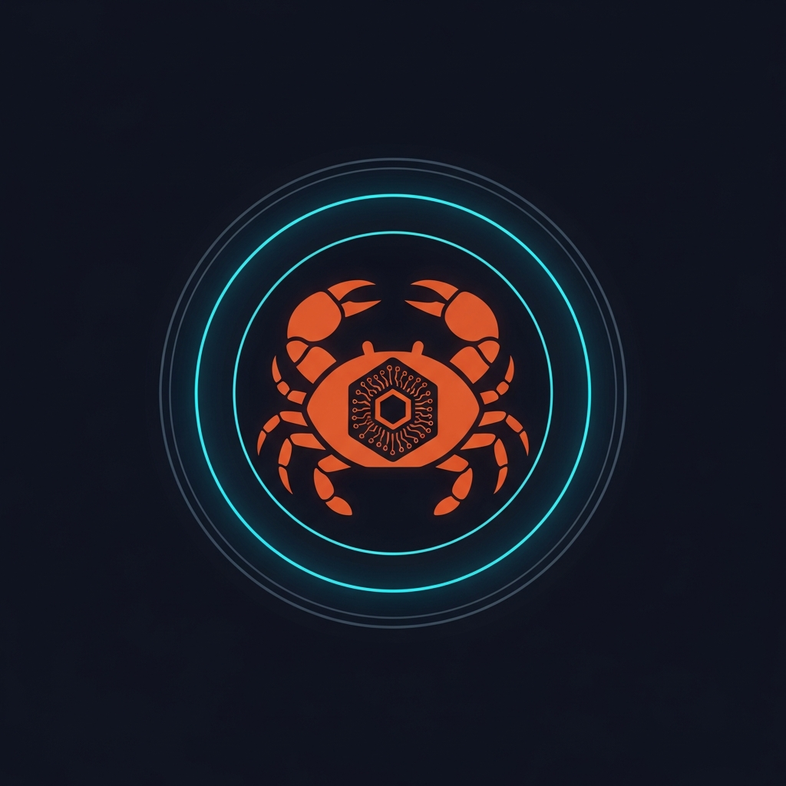
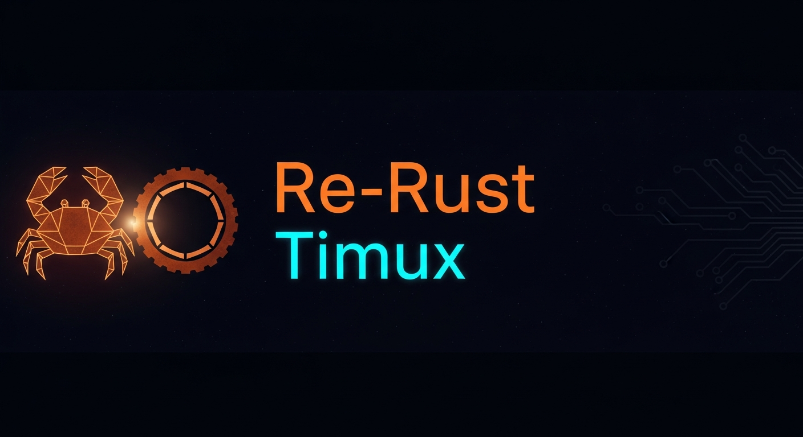

# Re-Rust / Timux — Sovereign OS Ecosystem

  <p align="center">
    
  </p>

  <p align="center">
    
  </p>

  <p align="center">
    <strong>A sovereign, high-performance operating system ecosystem built entirely in Rust.</strong><br/>
    Capability-gated · Fractal sub-kernels · Multi-arch · AI-native
  </p>

  <p align="center">
    
    
    
    
  </p>

  ---

  ## What is Re-Rust / Timux?

  **Timux** is a sovereign master kernel that acts as a Ring -1 Software-Defined Substrate.
  Isolation and authority are enforced via pure software capability tokens — no hardware rings, no hypervisor required.
  Each sub-kernel is a complete, independently-capability-gated OS instance that can host native Timux binaries
  or foreign applications (.deb / .exe) via the Sovereign Binary Shim Layer.

  **Re-Rust** is the surrounding ecosystem: AI inference engines, network stacks, boot managers,
  build tools, and a blueprint editor — all written in `#![no_std]` Rust.

  ```text
  ╔══════════════════════════════════════════════════════════════╗
  ║          RING -1 — SOVEREIGN ROOT SUBSTRATE (Timux)         ║
  ║  Capability Minting · MorphEngine · FractalScheduler         ║
  ╠══════════════════╦═══════════════════╦════════════════════════╣
  ║  SUB-KERNEL      ║  SUB-KERNEL       ║  SUB-KERNEL            ║
  ║  Native Timux    ║  Networking (net) ║  Binary Shim           ║
  ║  Bash++ TUI      ║  re-net TCP/UDP   ║  .deb / .exe / .apk    ║
  ╚══════════════════╩═══════════════════╩════════════════════════╝
  ```

  ---

  ## Workspace Map

  ### 🛡 Kernel & Core
  | Crate | Description |
  |---|---|
  | `kernel/timux` | Master sovereign kernel — capability model, MorphEngine, FractalScheduler, IKFS, shadow manager, hot-swap |
  | `kernel/ring-neg1` | Ring -1 bootloader — UEFI/BIOS, GOP framebuffer, TUI boot menu |
  | `kernel/tbm` | Timux Boot Manager — ELF loader, sovereign crypto, ingestion gate |
  | `kernel/tmx-core` | Personality lifecycle FSM for sub-kernels |
  | `core/re-core` | Shared types, traits, OnionRelay, ElfParser, vdisk header |

  ### 🧠 AI & Intelligence
  | Crate | Description |
  |---|---|
  | `ai-models/re-llm` | LLM inference on Candle — GGUF, quantisation, Phi-2 support |
  | `ai-models/re-agent` | Autonomous agent framework integrated into the Re-Rust runtime |

  ### 🌐 Runtimes
  | Crate | Description |
  |---|---|
  | `runtimes/re-net` | Capability-gated TCP/UDP network stack sub-kernel |
  | `runtimes/re-node` | Node runtime for the ecosystem |
  | `runtimes/re-docker` | Container integration layer |
  | `runtimes/re-npm` | Package management for Re-Rust modules |

  ### 🛠 Build Tools
  | Crate | Description |
  |---|---|
  | `build-tools/re-make` | Custom build system for the workspace |
  | `build-tools/re-ci` | Continuous integration tooling |
  | `build-tools/re-lint` | Linter and code quality enforcement |
  | `build-tools/re-pack` | Deployment and distribution packager |
  | `build-tools/re-hoffman` | Hoffman Script — declarative fractal OS forging (Nix fork) |

  ### 🧰 Utilities
  | Crate | Description |
  |---|---|
  | `utilities/re-blueprint` | Blueprint editor CLI — create, validate, encode .tmx boot blueprints |
| `utilities/oxidiser`     | **Oxidiser** — generate a complete sovereign OS from a single script  |
  | `utilities/re-crypt` | Cryptographic primitives |
  | `utilities/re-scrape` | High-performance data ingestion |
  | `utilities/re-sim` | Kernel simulation harness |
  | `utilities/tmx-view` | TUI dashboard for live kernel inspection |
  | `utilities/re-run` | Task runner |
  | `utilities/sushi` | Macro-based framework (`sushi-macros`) |
  | `utilities/crab-rs` | Crab utility suite |

  ---

  ## Key Features Implemented

  | Feature | Location | Status |
  |---|---|---|
  | Capability system (rings, AuditLog) | `timux/src/cap.rs` | ✅ |
  | FractalScheduler | `timux/src/sched/fractal.rs` | ✅ |
  | MorphEngine (XorShift64, dispatch shuffle) | `timux/src/morph/engine.rs` | ✅ |
  | Sub-kernel manager (spawn/terminate/suspend/resume) | `timux/src/subkernel/manager.rs` | ✅ |
  | Hot-swap coordinator (4-phase live replacement) | `timux/src/subkernel/hotswap.rs` | ✅ |
  | Shadow manager + failover | `timux/src/subkernel/shadow.rs` | ✅ |
  | MigrationBlob — encode/decode/sign/verify | `timux/src/subkernel/snapshot.rs` | ✅ |
  | Inter-Kernel Filesystem (IKFS) | `timux/src/ikfs/` | ✅ |
  | vDisk driver — format/mount/read/write | `timux/src/storage/vdisk.rs` | ✅ |
  | CortexMap — LRU eviction, volatile GC, pinning | `timux/src/mm/cortex_map.rs` | ✅ |
  | Arch impls — x86_64, ARM64, RISC-V | `timux/src/arch/` | ✅ |
  | TBM crypto — ChaCha20, SovereignHash, HMAC, HKDF | `kernel/tbm/src/crypto.rs` | ✅ |
  | TCP/UDP network stack | `runtimes/re-net/` | ✅ |
  | Blueprint editor CLI | `utilities/re-blueprint/` | ✅ |
  | Ring -1 TUI boot menu + framebuffer | `kernel/ring-neg1/` | ✅ |

  ---

  ## Getting Started

  ### Prerequisites
  ```bash
  # Rust 1.75+
  curl --proto '=https' --tlsv1.2 -sSf https://sh.rustup.rs | sh

  # Bare-metal targets
  rustup target add x86_64-unknown-none aarch64-unknown-none riscv64gc-unknown-none-elf
  ```

  ### Build
  ```bash
  # Full workspace
  cargo build

  # Specific crate
  cargo build -p timux
  cargo build -p re-net
  cargo build -p re-blueprint
  ```

  ### Blueprint CLI
  ```bash
  # Create a new boot blueprint
  re-blueprint new --json

  # Validate an existing blueprint
  re-blueprint validate my-system.tmxb

  # Encode to binary wire format
  re-blueprint encode my-system.tmxb -o my-system.bin
  ```

  ---

  ## Branding

  Logo and thumbnail assets live in [`branding/`](branding/).
  See [branding/README.md](branding/README.md) for colours, usage guidelines, and dimensions.

  ---

  ## License

  **AGPL-3.0** — See [LICENSE](LICENSE) for details.

  **Author:** Syed Ismaeel — Lucknow, Est. 2019
  
